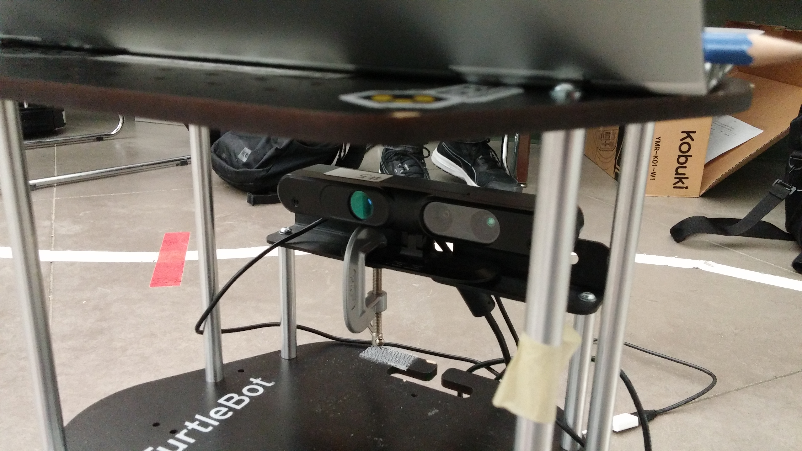
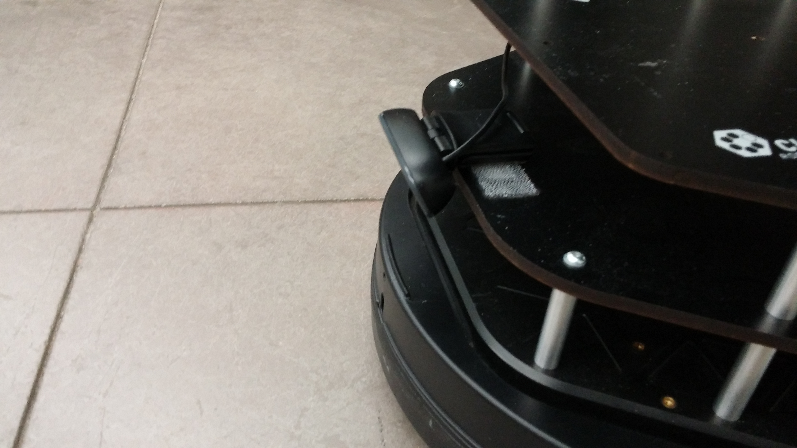
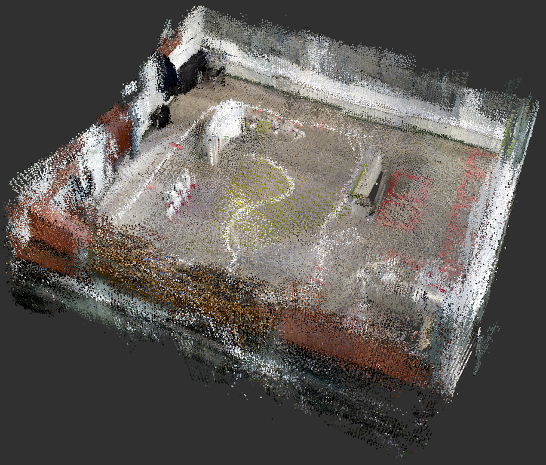

# Competition 3

The project shares much of its code with the previous competition, [competition 2](https://github.com/CMPUT412-2019/cmput412-competition2). As such, not all details of our algorithms and approach appear here, as we sometimes refer back to the documentation of that competition. In addition, occasional images and text within this Readme are sourced from the Readme from that competition.

## Setup and building

As before, the project requires ROS Kinetic with the various turtlebot and openni packages detailed on eClass. In addition, the project requires

  * [gTTs](https://github.com/pndurette/gTTS) to generate sounds
    ```shell script
    pip install gTTS
    ```
  * [rtabmap_ros](https://wiki.ros.org/rtabmap_ros) for mapping and localization
    ```shell script
    sudo apt install -y ros-kinetic-rtabmap-ros
    ```
  
  * The RGB-D camera in its default position on the robot, facing forward:
  
  
  * A webcam at the bottom front of the robot, looking down:
  
  (the code assumes this webcam corresponds with the device `/dev/video2`)
  
Once you have the requirements, download the source from the [release](https://github.com/CMPUT412-2019/competition3/releases/tag/1.0.0) on Github. Unpack it to `competition3`, and run

    cd competition3
    catkin build
    source devel/setup.bash

to build the project. If you don't have `catkin build`, use `catkin_make` instead.

As in the previous competition, you now need to generate sound files:

    cd sound
    python gen.py
    cd ..

This will take a while. Please be patient.


You now need to download the pre-built map (called `rtabmap.db`) from the [release](https://github.com/CMPUT412-2019/competition3/releases/tag/1.0.0). Put it into the [src/competition3/rtabmap/realworld](src/competition3/rtabmap/realworld) directory, so its new name is `src/competition3/rtabmap/realworld/rtabmap.db`

## Running the code

Plug the Kobuki base, RGB-D camera and webcam into your laptop. Then run the launch file `competition3.launch`:

    roslaunch competition3 competition3.launch

## Method

Method

The project uses a number of compoenents:

### Re-used components

The following components are the same as in competition 2:

 * [Line following](https://github.com/CMPUT412-2019/cmput412-competition2#line-following)
 * [Changing state at red lines](https://github.com/CMPUT412-2019/cmput412-competition2#changing-state-at-red-lines)
 * [Turning](https://github.com/CMPUT412-2019/cmput412-competition2#turning)
 * [Stopping](https://github.com/CMPUT412-2019/cmput412-competition2#stopping)

### Identifying objects

Our object identification code is similar to our implementation for [competition 2](https://github.com/CMPUT412-2019/cmput412-competition2#identifying-objects). However, we adjusted our shape detection algorithm, which now works as follows:

 * For the shape of interest, we obtain its contour
 * If the simplified contour (generated by cv2.approxPolyDP) has less than three points, we ignore the shape
 * If the simplified contour has exactly three points, we classify the shape as a triangle.
 * Otherwise, we assume the shape is either a circle or a square. We fit an ellipse to the contour using cv2.fitEllipse(), and a rect using cv2.minAreaRect(). If the ellipse's area is less than the rect's area, we classify the shape as a circle. Otherwise, we classify it as a square.

### Mapping and localization

The launch files of this component contain code (launch files) copied from the [ros_rtabmap](https://wiki.ros.org/rtabmap_ros) package.

The robot localizes itself within the room using the [ROS interface](https://wiki.ros.org/rtabmap_ros) for [RTAB-Map](https://introlab.github.io/rtabmap/). To accomplish this, we first built a detailed map of the room by running RTAB-Map in mapping mode and driving the robot around slowly (the launch file to do this is [build_map.launch](src/competition3/launch/build_map.launch).



Within the competition, RTAB-Map runs in localization mode to localize the robot. Both mapping and localization are also supported in simulation.

### Waypoint navigation

At various points in the competition the robot must travel toward certain pre-defined waypoints. We define these in [named_poses.yaml](src/competition3/param/realworld/named_poses.yaml) (our utility script [find_waypoints.py](src/competition3/script/find_waypoints.py) is helpful here). We move toward the waypoints using move_base through the SimpleActionClient API.

### Identifying and moving toward AR tags

At one point the robot has to search for and move toward an AR tag. The AR-tag searching algorithm is simple: first, we move toward a pre-defined waypoint from which we judge the AR tag should be visible. Then, we rotate the robot until it can see an AR tag, using the ar_track_alvar library. Finally, we assign a move goal to a position directly in front of the AR tag and use move_base through the SimpleActionClient API to move to the goal position. The goal position is updated every second to account for potential odometry drift issues.

### Off-ramp and on-ramp

During the competition, the robot must exit the line-following portion briefly to perform some tasks, then re-enter it at a different location.

When exiting the line-following portion, the robot must follow the right-most path in a split in the line. We implement this manually by moving to a pre-defined waypoint at the split's beginning, then another one at the end of the right-most line.

When entering the line-following portion, the robot must find the beginning of a line which merges into the main line. We do this by navigating to a pre-defined waypoint at the beginning of this line, then line-following like normal.

### Searching for a matching shape

This is accomplished by moving in sequence to pre-defined waypoints on each parking square. At each square, the robot checks the object in front of it for a match, exactly like the shape matching in [competition 2](https://github.com/CMPUT412-2019/cmput412-competition2).
